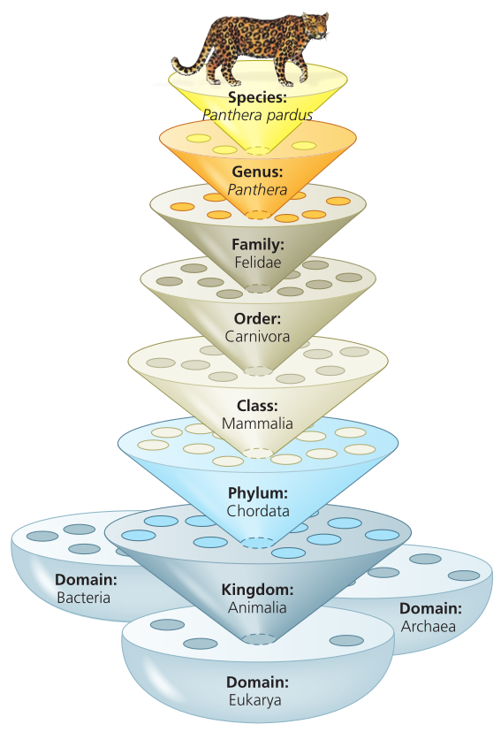
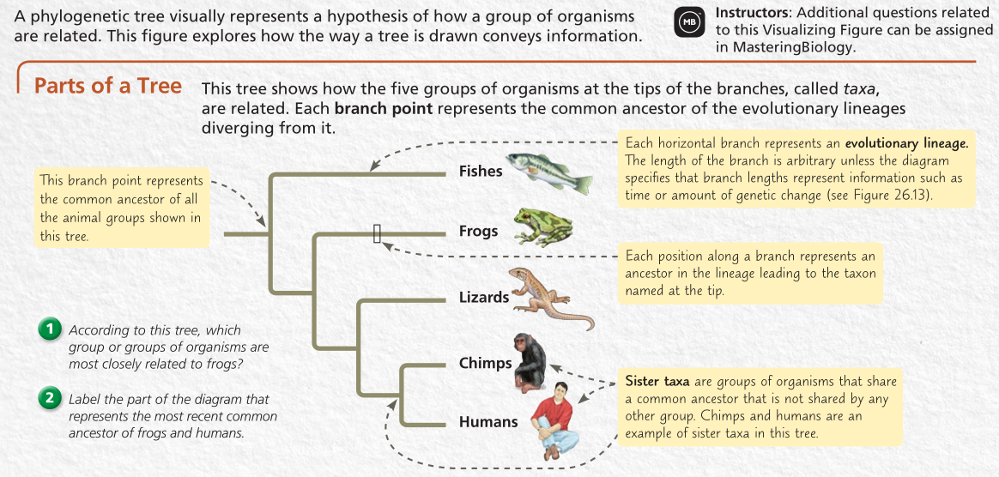
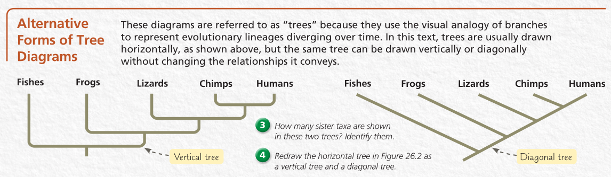
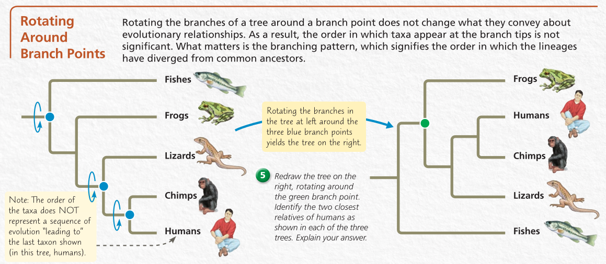
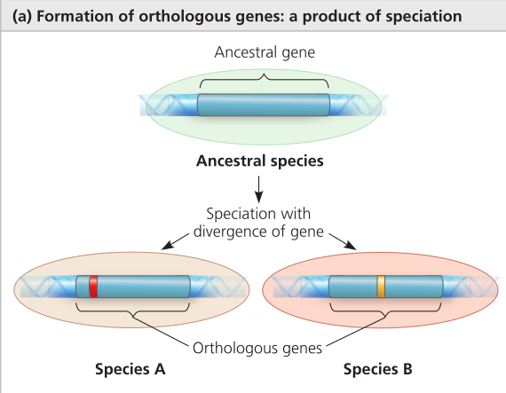
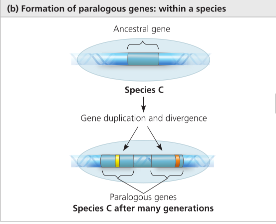

- [[#Ch26 - Phylogeny and the Tree of Life|Ch26 - Phylogeny and the Tree of Life]]
- [[#Morphology|Morphology]]

# Ch26 - Phylogeny and the Tree of Life

# Morphology
- **Homologous** = Structures that are **different** in appearance but **similar in function and layout**
    - Homologous structues show evolution from a commomn ancestor
    - **Orthologous genes** = Homology is the result of a speciation event and occurs between genes found in **different species**
    - 
- **Paralogous genes** = Homology results from **gene duplication** (i.e mulitple copies of these genes have diverged from one another within a species)
- 
- **Analogous** = Structures that have **similar characteristics** because of a **similar environment**
    - I.e flies insects and birds both have wings, but they are **not** evolutionarily related
- **Vestigial** = Unused structues w/o functions